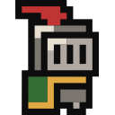

  

# Game of Life

<!-- 

  

 -->

> Game of Life

- 🚀 PWA
- 🐋 Containerized
- 🪄 CI/CD (Github Action)

## License

Published under the [GNU GPLv3](https://github.com/shba007/game-of-life/blob/main/LICENSE) license.
  

